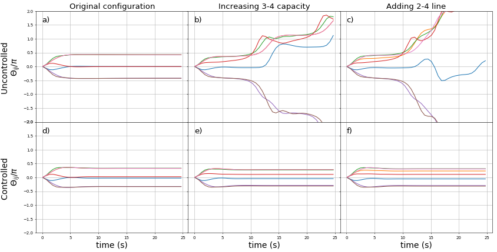

## SURF Summer Project at IFISC

Braess' paradox is a phenomenon that occurs when increasing some weights on a network, or adding new lines, instead of helping the performance we are destabilizing the network's operating state.
To avoid this happening, secondary control is needed to restore the value of the frequency to its nominal value once some disturbance is met.

Some Results:
Voltage phases variations as a function of time for an eight nodes network in a controlled (bottom images) and uncontrolled (upper images) scenario.

<figure>
  
</figure>

Reference: E.B. Tchawou Tchuisseu, D. Gomila, P. Colet1, D. Witthaut, M. Timme and B Schäfer "Curing Braess’ paradox by secondary control in power grids", 2018 New J. Phys.20 083005

[IFISC site](ifisc@ifisc.uib-csic.es)
