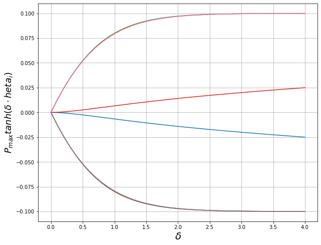
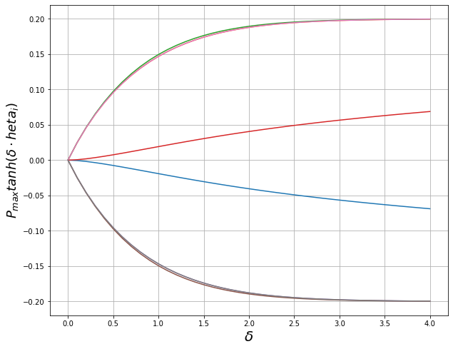
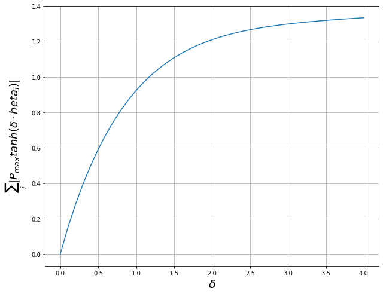

```python
from mpl_toolkits.mplot3d import Axes3D  # noqa: F401 unused import

import matplotlib.pyplot as plt
import pandas as pd
from matplotlib import cm
from matplotlib.ticker import LinearLocator, FormatStrFormatter
import numpy as np
plt.rcParams['savefig.dpi'] = 1000
```


```python
df = pd.read_csv('control_delta_Pmax_0.1', delim_whitespace = True, header = None)
df.head()
```


<div>
<style scoped>
    .dataframe tbody tr th:only-of-type {
        vertical-align: middle;
    }

    .dataframe tbody tr th {
        vertical-align: top;
    }

    .dataframe thead th {
        text-align: right;
    }
</style>
<table border="1" class="dataframe">
  <thead>
    <tr style="text-align: right;">
      <th></th>
      <th>0</th>
      <th>1</th>
      <th>2</th>
      <th>3</th>
      <th>4</th>
      <th>5</th>
      <th>6</th>
      <th>7</th>
      <th>8</th>
    </tr>
  </thead>
  <tbody>
    <tr>
      <th>0</th>
      <td>0.0</td>
      <td>0.000000</td>
      <td>0.000000</td>
      <td>0.000000</td>
      <td>-0.000000</td>
      <td>-0.000000</td>
      <td>-0.000000</td>
      <td>0.000000</td>
      <td>-0.000000</td>
    </tr>
    <tr>
      <th>1</th>
      <td>0.1</td>
      <td>-0.000173</td>
      <td>0.012686</td>
      <td>0.012716</td>
      <td>0.000173</td>
      <td>-0.012686</td>
      <td>-0.012716</td>
      <td>0.012686</td>
      <td>-0.012686</td>
    </tr>
    <tr>
      <th>2</th>
      <td>0.2</td>
      <td>-0.000583</td>
      <td>0.024194</td>
      <td>0.024301</td>
      <td>0.000583</td>
      <td>-0.024194</td>
      <td>-0.024301</td>
      <td>0.024194</td>
      <td>-0.024194</td>
    </tr>
    <tr>
      <th>3</th>
      <td>0.3</td>
      <td>-0.001142</td>
      <td>0.034541</td>
      <td>0.034753</td>
      <td>0.001142</td>
      <td>-0.034541</td>
      <td>-0.034753</td>
      <td>0.034541</td>
      <td>-0.034541</td>
    </tr>
    <tr>
      <th>4</th>
      <td>0.4</td>
      <td>-0.001804</td>
      <td>0.043760</td>
      <td>0.044086</td>
      <td>0.001804</td>
      <td>-0.043760</td>
      <td>-0.044086</td>
      <td>0.043760</td>
      <td>-0.043760</td>
    </tr>
  </tbody>
</table>
</div>


```python
delta = df.loc[:,0]
controls = df.loc[:, 1:8]
controls_abs = controls.abs()
controls_sum = controls_abs.sum(axis=1)
```


```python
fig = plt.figure(figsize=(10, 8))
ax = fig.add_subplot(111)
ax.plot(delta, controls)
ax.set_xlabel('$\delta$', fontsize=20, rotation=0)
ax.set_ylabel('$P_{max} tanh( \delta \cdot \theta_{i} )$', fontsize=18, rotation=90)
plt.grid()
plt.show()
```





```python
fig = plt.figure(figsize=(10, 8))
ax = fig.add_subplot(111)
ax.plot(delta, controls_sum)
ax.set_xlabel('$\delta$', fontsize=20, rotation=0)
ax.set_ylabel('$\sum_i | P_{max} tanh( \delta \cdot \theta_{i} )| $', fontsize=18, rotation=90)
plt.grid()
plt.show()
```


```python
df2 = pd.read_csv('control_delta_Pmax_0.2', delim_whitespace = True, header = None)
```


```python
delta2 = df2.loc[:,0]
controls2 = df2.loc[:, 1:8]
controls_abs2 = controls2.abs()
controls_sum2 = controls_abs2.sum(axis=1)
```


```python
fig = plt.figure(figsize=(10, 8))
ax = fig.add_subplot(111)
ax.plot(delta2, controls2)
ax.set_xlabel('$\delta$', fontsize=20, rotation=0)
ax.set_ylabel('$P_{max} tanh( \delta \cdot \theta_{i} ) $', fontsize=18, rotation=90)
plt.grid()
plt.show()
```





```python
fig = plt.figure(figsize=(10, 8))
ax = fig.add_subplot(111)
ax.plot(delta2, controls_sum2)
ax.set_xlabel('$\delta$', fontsize=20, rotation=0)
ax.set_ylabel('$\sum_i | P_{max} tanh( \delta \cdot \theta_{i} )| $', fontsize=18, rotation=90)
plt.grid()
plt.show()


#plt.plot(delta2, controls_sum2)
#plt.xlabel("$\delta$")
#plt.ylabel("$\sum_i | P_{max} tanh( \delta \cdot \theta_{i} )| $")
#plt.show()
```





```python
df3 = pd.read_csv('control_delta_Pmax2', delim_whitespace = True, header = None)
df3.head()
```


<div>
<style scoped>
    .dataframe tbody tr th:only-of-type {
        vertical-align: middle;
    }

    .dataframe tbody tr th {
        vertical-align: top;
    }

    .dataframe thead th {
        text-align: right;
    }
</style>
<table border="1" class="dataframe">
  <thead>
    <tr style="text-align: right;">
      <th></th>
      <th>0</th>
      <th>1</th>
      <th>2</th>
      <th>3</th>
      <th>4</th>
      <th>5</th>
      <th>6</th>
      <th>7</th>
      <th>8</th>
      <th>9</th>
    </tr>
  </thead>
  <tbody>
    <tr>
      <th>0</th>
      <td>0.0</td>
      <td>0.0</td>
      <td>0.0</td>
      <td>0.0</td>
      <td>0.0</td>
      <td>-0.0</td>
      <td>-0.0</td>
      <td>-0.0</td>
      <td>0.0</td>
      <td>-0.0</td>
    </tr>
    <tr>
      <th>1</th>
      <td>0.1</td>
      <td>0.0</td>
      <td>0.0</td>
      <td>0.0</td>
      <td>0.0</td>
      <td>-0.0</td>
      <td>-0.0</td>
      <td>-0.0</td>
      <td>0.0</td>
      <td>-0.0</td>
    </tr>
    <tr>
      <th>2</th>
      <td>0.2</td>
      <td>0.0</td>
      <td>0.0</td>
      <td>0.0</td>
      <td>0.0</td>
      <td>-0.0</td>
      <td>-0.0</td>
      <td>-0.0</td>
      <td>0.0</td>
      <td>-0.0</td>
    </tr>
    <tr>
      <th>3</th>
      <td>0.3</td>
      <td>0.0</td>
      <td>0.0</td>
      <td>0.0</td>
      <td>0.0</td>
      <td>-0.0</td>
      <td>-0.0</td>
      <td>-0.0</td>
      <td>0.0</td>
      <td>-0.0</td>
    </tr>
    <tr>
      <th>4</th>
      <td>0.4</td>
      <td>0.0</td>
      <td>0.0</td>
      <td>0.0</td>
      <td>0.0</td>
      <td>-0.0</td>
      <td>-0.0</td>
      <td>-0.0</td>
      <td>0.0</td>
      <td>-0.0</td>
    </tr>
  </tbody>
</table>
</div>


```python
delta3 = df3.loc[:,0]
Pmax3 = df3.loc[:,1]
controls3 = df3.loc[:, 2:9]
controls_abs3 = controls3.abs()
controls_sum3 = controls_abs3.sum(axis=1)
```


```python
delta3 = np.matrix(delta3)
Pmax3 = np.matrix(Pmax3)
control_sum3 = np.matrix(controls_sum3)
print(delta3.shape)
x = np.reshape(delta3, (492))
print(x.shape)
x = np.reshape(delta3, (123, 4))
print(x.shape)
```

    (1, 492)
    (1, 492)
    (123, 4)


```python
len(delta3)
x = np.reshape(delta3, (4, 123))
y = np.reshape(Pmax3, (4, 123))
z = np.reshape(control_sum3, (4, 123))
```


```python
fig = plt.figure(figsize=(14,12))
ax = fig.add_subplot(111, projection='3d')

ax.plot_surface(x, y, z)

ax.set_xlabel('$\delta$', fontsize=22, rotation=150)
ax.set_ylabel('$Pmax$', fontsize=20)
ax.set_zlabel('$\sum_i | P_{max} tanh( \delta \cdot \theta_{i} )| $', fontsize=20, rotation=60)
plt.show()
```


```python
fig = plt.figure(figsize=(14,12))
ax = fig.gca(projection='3d')

surf = ax.plot_surface(x, y, z, cmap=cm.coolwarm,
                       linewidth=0, antialiased=False)

# Add a color bar which maps values to colors.
#fig.colorbar(surf, shrink=0.5, aspect=5)

ax.set_xlabel('$\delta$', fontsize=22, rotation=150)
ax.set_ylabel('$Pmax$', fontsize=10)
ax.set_zlabel('$\sum_i | P_{max} tanh( \delta \cdot \theta_{i} )| $', fontsize=10, rotation=60)
plt.show()
```


