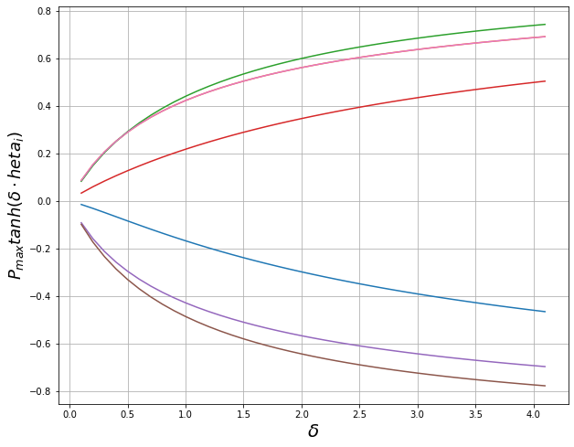
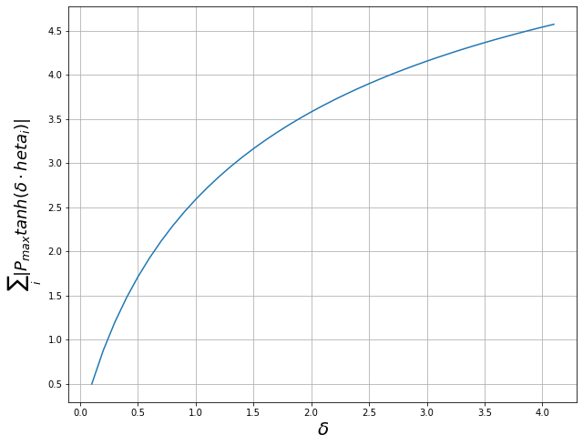
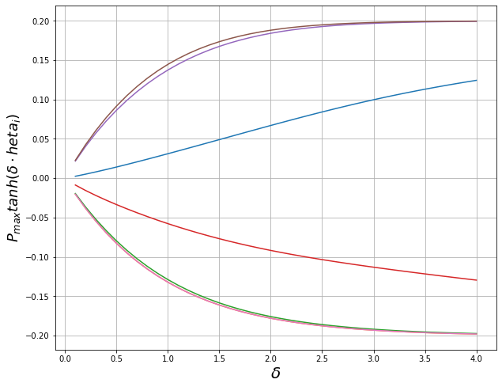
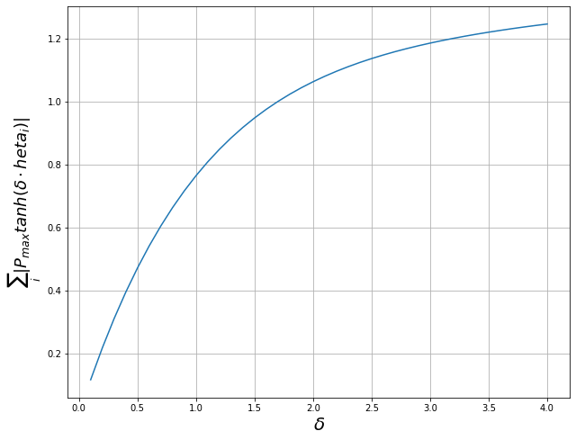
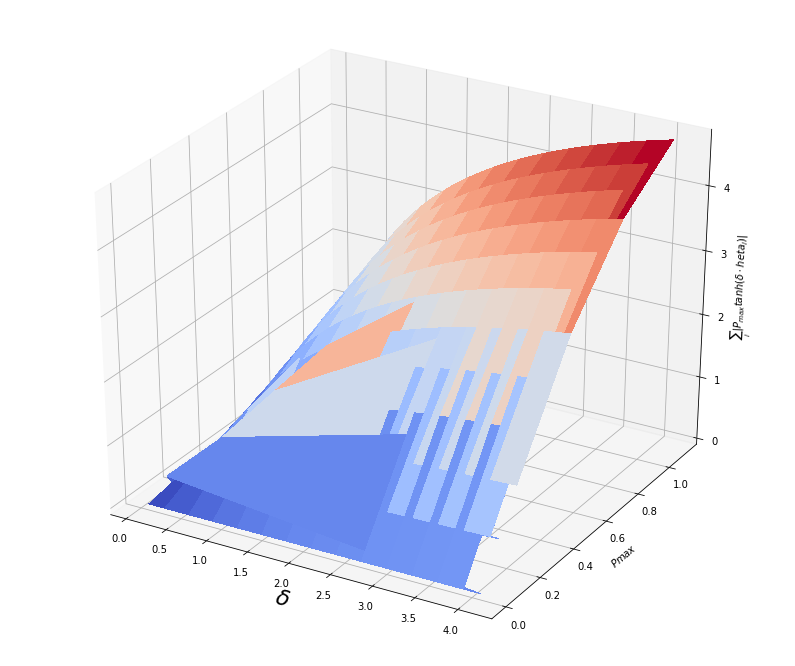

```python
from mpl_toolkits.mplot3d import Axes3D  # noqa: F401 unused import

import matplotlib.pyplot as plt
import pandas as pd
from matplotlib import cm
from matplotlib.ticker import LinearLocator, FormatStrFormatter
import numpy as np
plt.rcParams['savefig.dpi'] = 1000
```


```python
df = pd.read_csv('control_delta_doubling_3-4_line', delim_whitespace = True)
df.head()
```


<div>
<style scoped>
    .dataframe tbody tr th:only-of-type {
        vertical-align: middle;
    }

    .dataframe tbody tr th {
        vertical-align: top;
    }

    .dataframe thead th {
        text-align: right;
    }
</style>
<table border="1" class="dataframe">
  <thead>
    <tr style="text-align: right;">
      <th></th>
      <th>delta</th>
      <th>Pmax</th>
      <th>control[0]</th>
      <th>control[1]</th>
      <th>control[2]</th>
      <th>control[3]</th>
      <th>control[4]</th>
      <th>control[5]</th>
      <th>control[6]</th>
      <th>control[7]</th>
    </tr>
  </thead>
  <tbody>
    <tr>
      <th>0</th>
      <td>4.1</td>
      <td>1.1</td>
      <td>-0.492511</td>
      <td>0.714528</td>
      <td>0.774335</td>
      <td>0.530559</td>
      <td>-0.717260</td>
      <td>-0.806918</td>
      <td>0.714528</td>
      <td>-0.717260</td>
    </tr>
    <tr>
      <th>1</th>
      <td>4.0</td>
      <td>1.1</td>
      <td>-0.486523</td>
      <td>0.710496</td>
      <td>0.770032</td>
      <td>0.525033</td>
      <td>-0.713260</td>
      <td>-0.803013</td>
      <td>0.710496</td>
      <td>-0.713260</td>
    </tr>
    <tr>
      <th>2</th>
      <td>3.9</td>
      <td>1.1</td>
      <td>-0.480372</td>
      <td>0.706328</td>
      <td>0.765567</td>
      <td>0.519354</td>
      <td>-0.709125</td>
      <td>-0.798954</td>
      <td>0.706328</td>
      <td>-0.709125</td>
    </tr>
    <tr>
      <th>3</th>
      <td>3.8</td>
      <td>1.1</td>
      <td>-0.474053</td>
      <td>0.702015</td>
      <td>0.760930</td>
      <td>0.513515</td>
      <td>-0.704845</td>
      <td>-0.794733</td>
      <td>0.702015</td>
      <td>-0.704845</td>
    </tr>
    <tr>
      <th>4</th>
      <td>3.7</td>
      <td>1.1</td>
      <td>-0.467557</td>
      <td>0.697551</td>
      <td>0.756110</td>
      <td>0.507509</td>
      <td>-0.700414</td>
      <td>-0.790337</td>
      <td>0.697551</td>
      <td>-0.700414</td>
    </tr>
  </tbody>
</table>
</div>


#### selecting dataframe for Pmax = 1


```python
df_Pmax1 = df[df.Pmax == 1.0]
delta1 = df_Pmax1.loc[:, 'delta']
controls1 = df_Pmax1.iloc[:,2:9]
controls1_abs = controls1.abs()
controls1_sum = controls1_abs.sum(axis=1)
```


```python
fig = plt.figure(figsize=(10, 8))
ax = fig.add_subplot(111)
ax.plot(delta1, controls1)
ax.set_xlabel('$\delta$', fontsize=20, rotation=0)
ax.set_ylabel('$P_{max} tanh( \delta \cdot \theta_{i} )$', fontsize=18, rotation=90)
plt.grid()
plt.show()
```





```python
fig = plt.figure(figsize=(10, 8))
ax = fig.add_subplot(111)
ax.plot(delta1, controls1_sum)
ax.set_xlabel('$\delta$', fontsize=20, rotation=0)
ax.set_ylabel('$\sum_i | P_{max} tanh( \delta \cdot \theta_{i} )| $', fontsize=18, rotation=90)
plt.grid()
plt.show()
```





#### Pmax = 0.2


```python
df2 = pd.read_csv('control_varying_delta_Pmax_0.2_doubling_3-4_line', delim_whitespace = True, header = None)
df2.head()
```


<div>
<style scoped>
    .dataframe tbody tr th:only-of-type {
        vertical-align: middle;
    }

    .dataframe tbody tr th {
        vertical-align: top;
    }

    .dataframe thead th {
        text-align: right;
    }
</style>
<table border="1" class="dataframe">
  <thead>
    <tr style="text-align: right;">
      <th></th>
      <th>0</th>
      <th>1</th>
      <th>2</th>
      <th>3</th>
      <th>4</th>
      <th>5</th>
      <th>6</th>
      <th>7</th>
      <th>8</th>
    </tr>
  </thead>
  <tbody>
    <tr>
      <th>0</th>
      <td>4.0</td>
      <td>0.124401</td>
      <td>-0.197982</td>
      <td>-0.197391</td>
      <td>-0.129498</td>
      <td>0.199401</td>
      <td>0.199650</td>
      <td>-0.197982</td>
      <td>0.199401</td>
    </tr>
    <tr>
      <th>1</th>
      <td>3.9</td>
      <td>0.122299</td>
      <td>-0.197713</td>
      <td>-0.197073</td>
      <td>-0.127964</td>
      <td>0.199291</td>
      <td>0.199581</td>
      <td>-0.197713</td>
      <td>0.199291</td>
    </tr>
    <tr>
      <th>2</th>
      <td>3.8</td>
      <td>0.120122</td>
      <td>-0.197409</td>
      <td>-0.196717</td>
      <td>-0.126409</td>
      <td>0.199161</td>
      <td>0.199499</td>
      <td>-0.197409</td>
      <td>0.199161</td>
    </tr>
    <tr>
      <th>3</th>
      <td>3.7</td>
      <td>0.117867</td>
      <td>-0.197066</td>
      <td>-0.196320</td>
      <td>-0.124832</td>
      <td>0.199008</td>
      <td>0.199400</td>
      <td>-0.197066</td>
      <td>0.199008</td>
    </tr>
    <tr>
      <th>4</th>
      <td>3.6</td>
      <td>0.115533</td>
      <td>-0.196680</td>
      <td>-0.195876</td>
      <td>-0.123232</td>
      <td>0.198826</td>
      <td>0.199283</td>
      <td>-0.196680</td>
      <td>0.198826</td>
    </tr>
  </tbody>
</table>
</div>


```python
delta2 = df2.iloc[:,0]
controls2 = df2.iloc[:, 1:8]
controls2_abs = controls2.abs()
controls2_sum = controls2_abs.sum(axis=1)
```


```python
fig = plt.figure(figsize=(10, 8))
ax = fig.add_subplot(111)
ax.plot(delta2, controls2)
ax.set_xlabel('$\delta$', fontsize=20, rotation=0)
ax.set_ylabel('$P_{max} tanh( \delta \cdot \theta_{i} )$', fontsize=18, rotation=90)
plt.grid()
plt.show()
```





```python
fig = plt.figure(figsize=(10, 8))
ax = fig.add_subplot(111)
ax.plot(delta2, controls2_sum)
ax.set_xlabel('$\delta$', fontsize=20, rotation=0)
ax.set_ylabel('$\sum_i | P_{max} tanh( \delta \cdot \theta_{i} )| $', fontsize=18, rotation=90)
plt.grid()
plt.show()
```





#### surface plot


```python
delta3 = df.iloc[:,0]
Pmax3 = df.iloc[:,1]
controls3 = df.iloc[:, 2:9]
controls_abs3 = controls3.abs()
controls_sum3 = controls_abs3.sum(axis=1)
```


```python
delta3 = np.matrix(delta3)
Pmax3 = np.matrix(Pmax3)
control_sum3 = np.matrix(controls_sum3)
print(delta3.shape)
x = np.reshape(delta3, (492))
print(x.shape)
x = np.reshape(delta3, (123, 4))
print(x.shape)
```

    (1, 492)
    (1, 492)
    (123, 4)


```python
print(len(delta3))
x = np.reshape(delta3, (4, 123))
y = np.reshape(Pmax3, (4, 123))
z = np.reshape(control_sum3, (4, 123))
```

    1


```python
fig = plt.figure(figsize=(14,12))
ax = fig.add_subplot(111, projection='3d')

ax.plot_surface(x, y, z)

ax.set_xlabel('$\delta$', fontsize=22, rotation=150)
ax.set_ylabel('$Pmax$', fontsize=20)
ax.set_zlabel('$\sum_i | P_{max} tanh( \delta \cdot \theta_{i} )| $', fontsize=20, rotation=60)
plt.show()
```





```python
fig = plt.figure(figsize=(14,12))
ax = fig.gca(projection='3d')

surf = ax.plot_surface(x, y, z, cmap=cm.coolwarm,
                       linewidth=0, antialiased=False)

# Add a color bar which maps values to colors.
#fig.colorbar(surf, shrink=0.5, aspect=5)

ax.set_xlabel('$\delta$', fontsize=22, rotation=150)
ax.set_ylabel('$Pmax$', fontsize=10)
ax.set_zlabel('$\sum_i | P_{max} tanh( \delta \cdot \theta_{i} )| $', fontsize=10, rotation=60)
plt.show()
```


